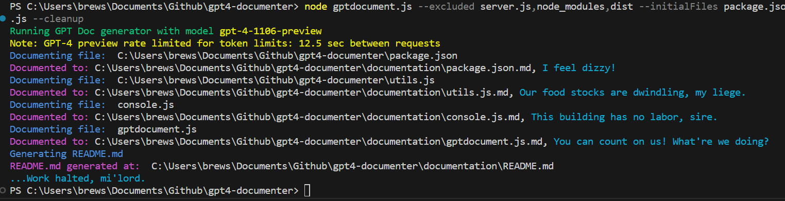

# Documentation Generation Tool with GPT 4 Turbo!

This uses the beta thread and assistant features of the official [openai node API](https://github.com/openai/openai-node). See [Reference](https://platform.openai.com/docs/api-reference/assistants)

For global usage:

`npm i -g gptdocwriter`

Set API Key (saved to the library folder (keep private!!) in config.txt):

`gptdocwriter --apiKey sk-abcdefg`

Then, from your desired folder:

`gptdocwriter --initialFiles index.js,utils.js --extensions .js,.jsx --excluded dist,node_modules --model gpt-4-1106-preview`

entryPoint defaults to current working directory

## Features

- Set an API key for authenticating with the OpenAI API.
- Generate documentation based on specified entry points, file types, and other criteria.
- Exclude certain files or directories from being documented.
- Define custom models, output formats, and additional instructions for the AI to follow.

## Usage

The various command line arguments include. Combine as needed. Call --apiKey first. Fundamentally this tool just creates a thread to read files and output a file for each file read, with context building with each file. At the end we write a README.md which should account for the knowledge of your files that GPT accumulated over the process.

```bash

# Set the API key for OpenAI services
gptdocwriter --apiKey sk-abcdefg

#defaults to current working directory
gptdocwriter --entryPoint path/to/src

# Generate documentation for specific files before crawling extensions in the order they appear
gptdocwriter --initialFiles utils.js,gptdocument.js

# Exclude files or directories from being documented
gptdocwriter --excluded server.js,node_modules,dist

# Specify which file extensions to include in the documentation
gptdocwriter --extensions js,ts,tsx,jsx

# Choose the GPT-4 model variant to use. We are rate limiting for the latest preview for you.
gptdocwriter --model gpt-4-turbo-1106

# Clear current assistant before/after generating documentation (will be cleared if instructions are updated)
gptdocwriter --cleanup

# Tailor the prompt for the AI instead of the default prompt
gptdocwriter --instructions Write detailed documentation about each file

# Include additional specific instructions
gptdocwriter --extraInstructions Mention the CLI input arguments

# Specify the project name within the readme
gptdocwriter --name gptdocwriter

# Change the output format to another extension than .md, e.g. we could transpose files from one programming language to another 
gptdocwriter --outputFormat .py

# Adjust the readme content template
gptdocwriter --readme Summarize this in a digestible format for folks who got a D in English

# Rate Limit requests (default 12.5sec for GPT 4 preview, change as necessary, we'll adapt too as rate limits are uncapped)
gptdocwriter --rateLimit 20

# Don't clear the thread at the end (default false else it would keep context on the next folder)
gptdocwriter --keepThread
```




Or set in utils.js and execute this locally via `node gptdocument.js xxx`

Or module usage:
```js 

import {generateDocumentation} from 'gptdocwriter'

// CLI usage to call generateDocumentation
generateDocumentation(
    process.cwd(), 
    ['utils.js'],  //scan the rest of the files after this specified order is completed
    ['.js', '.ts', '.mjs', '.jsx', '.tsx'], 
    ['dist','node_modules']
);

```

The prompt for all of this is experimental so tweak it as you need. Results can vary wildly though we tried to make it consistent enough to be passable, but you will need to edit your files afterward (which you should be doing anyway for serious documentation, this only provides an enhanced template).

See a repo where I applied this to a fairly hefty codebase: [JS Maze Generator with A* solver](https://github.com/joshbrew/JS-Maze-Generator-with-A-Star-Solver/tree/main/documentation)

### GPT generated docs below, with extra instructions to use strict iambic pentameter:

- Generated with: `node gptdocument.js --excluded server.js,node_modules,dist --initialFiles package.json,utils.js --cleanup --extraInstructions Write EVERYTHING in iambic pentameter verse without exception.`

# GPT Doc Writer 📜✍️

In lands of code where silence reigns, <br/>
The GPT Doc Writer deigns, <br/>
To turn the tide of documentation's chore, <br/>
Into an art, less bore, more lore.

## Quick Start 🚀

To weave the magic of this script's employ, <br/>
Ensure to set the API deploy. <br/>
Run commands below, command line's your stage, <br/>
To document your code, turn a new page.

```bash
gptdocwriter --apiKey YOUR_API_KEY
gptdocwriter --entryPoint path/to/src --initialFiles utils.js,gptdocument.js
# ...and any other options you wish to engage
```

## Installation 🛠

In terminal's embrace, these words recite, <br/>
And lo, the GPT Doc Writer takes flight:

```bash
npm install -g gptdocwriter
# or, for the bards who seek yonder ridge:
yarn add gptdocwriter
```

## Usage 📖

Invoke with args that you understand, <br/>
From where to start, what files to demand. <br/>
Exclude, include, with precision's touch, <br/>
And see how well it documents much.

## Documentation Directory 🗂

Herein the structure, clear and deft, <br/>
With markdown files, right and left:

- [`./documentation/utils.js.md`](./documentation/utils.js.md): Tools to map and glow, <br/>
  CLI args and configs, oh, do they flow!
- [`./documentation/console.js.md`](./documentation/console.js.md): Colors to command, woesome console to tame, <br/>
  A parser of args, all in the game.

## Use Cases 🎯

- In times of rush, when docs are drear, <br/>
  This tool comes forth to lend an ear. <br/>
- For projects vast as the sea's own realm, <br/>
  GPT Doc Writer takes the helm. <br/>
- And should you wish to transit code, <br/>
  To another language, to lighten the load, <br/>
  With output formats, it strides in stride, <br/>
  From `.js` to `.py`, worlds do collide.

## In Summation's Grasp 🌟

With snazzy flare and emojis bright, <br/>
This README lends developers light. <br/>
Installation, usage at the top reside, <br/>
Use cases follow, in this README's guide.

With GPT Doc Writer, fear recedes, <br/>
For it documents as thou proceeds. <br/>
And for the travelers through code's night, <br/>
This README will serve as lantern's light.


